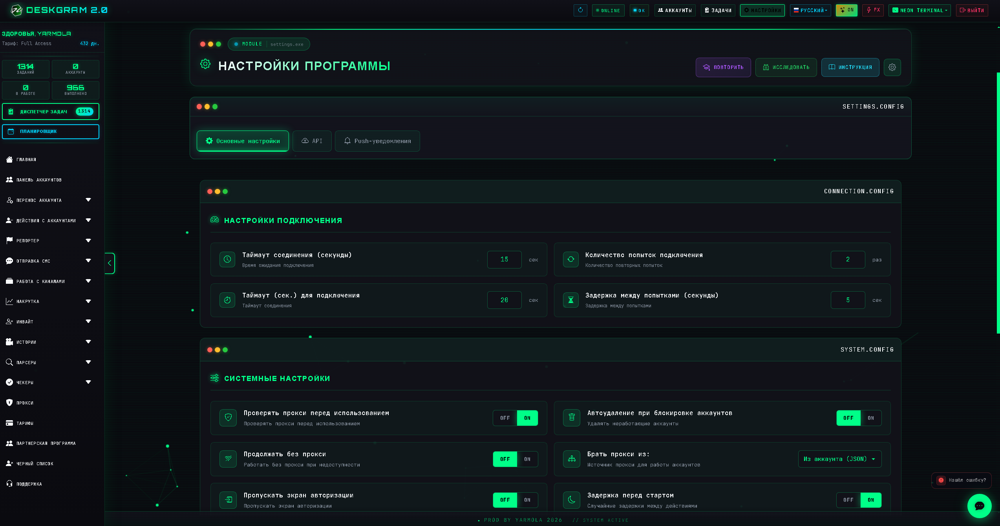
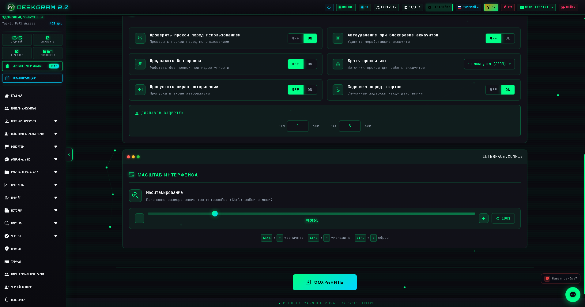
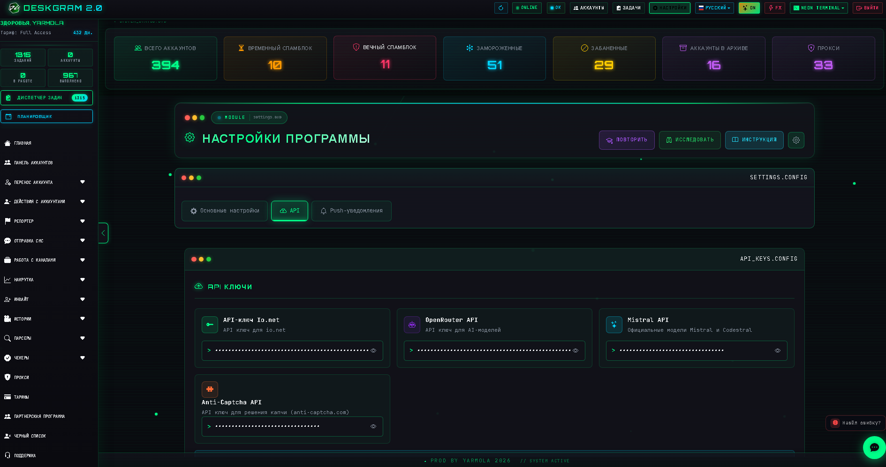

# Настройки автоматизации Telegram в Deskgram 2

Настройки в Deskgram 2 — это системный раздел, где задаются ключевые параметры программы: базовые соединения, системные опции, API-ключи, AI-провайдеры и уведомления. Это один из главных инфраструктурных узлов перед активной работой с модулями.

[Главный хаб Deskgram 2](https://github.com/Deskgram-2/deskgram-2-telegram-automation) · [Сайт](https://deskgram2.com/) · [Telegram-бот](https://t.me/DG2welcomebot) · [Web preview](https://deskgram2.com/web-preview)

## Кратко о разделе

| Параметр | Что внутри |
|---|---|
| Основная задача | Настройка системных параметров Deskgram 2 |
| Что помогает делать | Управлять подключениями, AI-ключами, поведением интерфейса и уведомлениями |
| Полезен для | Подготовки программы перед работой с модулями |
| Важные зоны | Основные настройки, системные параметры, API-ключи, уведомления |
| Связанные разделы | Нейрокомментинг, Управление прокси, Панель аккаунтов |

## Что умеет раздел настроек

- хранить основные параметры программы;
- задавать системные и интерфейсные опции;
- подключать API-ключи и AI-провайдеров;
- управлять уведомлениями о событиях;
- сохранять инфраструктурную конфигурацию под рабочие сценарии;
- служить общей точкой подготовки перед запуском модулей.

## Быстрый старт

1. Откройте основные настройки и проверьте базовые параметры.
2. Настройте системные опции и поведение интерфейса.
3. Добавьте API-ключи и AI-провайдеров, если они нужны в сценариях.
4. Включите уведомления под ваш рабочий процесс.
5. Сохраните изменения перед запуском модулей.

## Какие модули чаще всего зависят от этих настроек

- [Нейрокомментинг](https://github.com/Deskgram-2/telegram-neuro-commenting-deskgram), если используются AI-провайдеры и общие системные параметры;
- [Рассылка в ЛС](https://github.com/Deskgram-2/telegram-direct-messaging-deskgram), когда важны стабильные общие настройки и уведомления;
- [Панель аккаунтов](https://github.com/Deskgram-2/telegram-account-manager-deskgram), если вы сначала собираете инфраструктурную базу;
- [Управление прокси](https://github.com/Deskgram-2/telegram-proxy-manager-deskgram), если сетка аккаунтов требует корректной инфраструктуры;
- [Диспетчер задач](https://github.com/Deskgram-2/telegram-task-manager-deskgram), если хотите контролировать рабочие процессы уже после запуска.

## Интерфейс раздела

### Главный экран

Здесь находятся основные вкладки и общая структура системных настроек.

### Системные параметры

В этом блоке настраиваются параметры, которые влияют на общую работу программы.

### API-ключи и AI

Через этот блок подключаются внешние сервисы и AI-провайдеры для связанных модулей.

## Когда особенно полезен

- когда вы впервые готовите Deskgram 2 к работе;
- когда в сценариях используются AI-модули и внешние API;
- когда нужно централизованно управлять общими параметрами программы;
- когда важно заранее собрать рабочую инфраструктуру, а не настраивать ее на ходу.

## Почему это удобнее хаотичной настройки

| Ручной подход | Настройки в Deskgram 2 |
|---|---|
| Параметры разбросаны по разным окнам | Все основные настройки собраны в одном разделе |
| Легко забыть про API и системные опции | Есть единая точка подготовки программы |
| Инфраструктура настраивается уже в процессе работы | Можно заранее подготовить рабочую среду |
| Уведомления и поведение программы не связаны между собой | Все важные параметры видны централизованно |
| Сложнее поддерживать порядок в конфигурации | Раздел настроек помогает держать систему под контролем |

## Смежные репозитории

- [Главный хаб Deskgram 2](https://github.com/Deskgram-2/deskgram-2-telegram-automation)
- [Управление прокси](https://github.com/Deskgram-2/telegram-proxy-manager-deskgram)
- [Нейрокомментинг](https://github.com/Deskgram-2/telegram-neuro-commenting-deskgram)
- [Рассылка в ЛС](https://github.com/Deskgram-2/telegram-direct-messaging-deskgram)
- [Панель аккаунтов](https://github.com/Deskgram-2/telegram-account-manager-deskgram)
- [Диспетчер задач](https://github.com/Deskgram-2/telegram-task-manager-deskgram)

## FAQ

### Когда лучше заходить в настройки?

Лучше всего до запуска активных модулей, чтобы инфраструктура уже была подготовлена.

### Для чего нужны API-ключи в этом разделе?

Они нужны для интеграций и AI-сценариев, которые используются в отдельных модулях.

### Нужно ли часто возвращаться в настройки?

Да, если вы меняете инфраструктуру, провайдеров, системные параметры или формат уведомлений.

### Какой следующий шаг после настройки программы?

Обычно дальше переходят в панель аккаунтов, прокси и затем в рабочие модули.

## Полезные ссылки

- [Главный хаб Deskgram 2](https://github.com/Deskgram-2/deskgram-2-telegram-automation)
- [Сайт Deskgram 2](https://deskgram2.com/)
- [Telegram-бот Deskgram 2](https://t.me/DG2welcomebot)
- [Web preview](https://deskgram2.com/web-preview)
